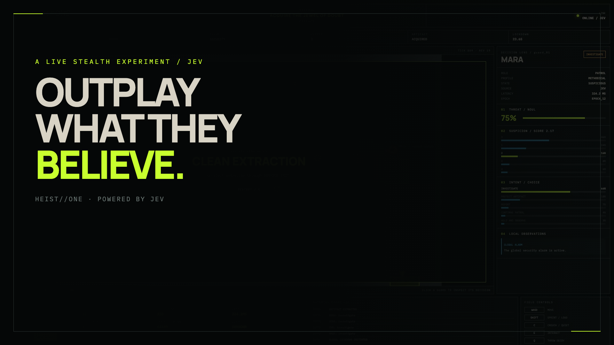
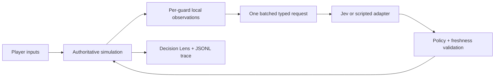

<p align="center">
  <a href="https://github.com/AbdelStark/heist-one/releases/download/v0.1.0/heist-one-launch.mp4">
    
  </a>
</p>

<h1 align="center">HEIST//ONE</h1>

<p align="center">
  An observable stealth game where Jev supplies guards' split-second judgments<br />
  while deterministic code remains in control of the world.
</p>

<p align="center">
  <a href="https://github.com/AbdelStark/heist-one/actions/workflows/ci.yml"></a>
  <a href="https://github.com/AbdelStark/heist-one/releases/tag/v0.1.0"></a>
  <a href="LICENSE"></a>
  <a href="#quick-start"></a>
</p>

<p align="center">
  <a href="https://github.com/AbdelStark/heist-one/releases/download/v0.1.0/heist-one-launch.mp4"><strong>Watch the 37-second film</strong></a>
  ·
  <a href="docs/LIVE-JEV-VERIFICATION.md">Inspect the live-run evidence</a>
  ·
  <a href="SPEC.md">Read the technical specification</a>
</p>

## Why a heist game?

Stealth is a legible test bed for decisions under ambiguity. A guard rarely has
perfect information: a door opens, a light goes out, footsteps come from an
empty room, or someone with the right jacket carries the wrong badge.

HEIST//ONE makes those judgments visible. Select any guard to inspect the
evidence it received, its probability distributions, confidence, proposed
intent, applied intent, latency, and fallback state. You are not fighting hidden
scripts; you are manipulating what the guards have reason to believe.

The design follows TypeSafe's recommended shape for Jev: ask narrow, typed
questions, then let ordinary software validate and act on the answers. Jev is
used as a tactical judgment engine—not as the game engine.

## The boundary that matters

| Jev proposes | Deterministic code owns |
| --- | --- |
| Whether local evidence suggests a threat (`Noul`) | Authoritative 30 Hz simulation |
| How suspicious a guard should be (`Score`) | Visibility, collision, navigation, and physics |
| Which legal tactical intent fits (`Choice`) | Legal actions, access control, and side effects |
| Which observed entity deserves attention (`Choice`) | Inventory, alarms, win/loss, and lockdown |
| Probabilities and confidence for each judgment | Deadline handling, stale-response rejection, and fallback |

Every provider response is a proposal. The server rejects illegal targets,
stale context revisions, and policy-incompatible actions before they can affect
the simulation.



## What is in the MVP

- One deterministic museum with six guards, three access-controlled doors,
  disguises, credentials, light control, noise decoys, one artifact, and two exits.
- An authoritative server simulation; the browser renders snapshots and sends
  inputs over a WebSocket.
- Event-driven decision scheduling with a bounded refresh, one request covering
  all four typed judgments for every guard.
- A live adapter for the official [`@typesafe-ai/sdk`](https://github.com/typesafe-ai/typesafe-sdk-js)
  and a deterministic scripted adapter for credentials-free play and tests.
- A Decision Lens that exposes the complete applied judgment—not merely the
  winning label.
- Append-only JSONL evidence traces for requests, responses, material world
  events, outcomes, latency, usage, fallbacks, and deterministic checkpoints.
- A full browser-controlled clean-extraction test and a reproducible Remotion
  launch-film project.

## Verified live run

On 17 September 2026, the complete jacket → badge → vault → artifact → exit
route ran against the TypeSafe sandbox through `JevDecisionEngine`.

| Observed measure | Result |
| --- | ---: |
| Outcome | Clean extraction (`won`) |
| Batched requests | 12 |
| Typed judgments | 288 |
| Successful responses | 12 / 12 |
| Decision errors | 0 |
| Fallbacks | 0 |
| Stale decisions | 0 |
| Median adapter latency | 259.9 ms |
| p95 adapter latency | 344.1 ms |
| Provider usage | 63,349 input / 12,181 output tokens |
| Exact provider cost | Unknown—not exposed by the response |

This is evidence of one end-to-end run, not a benchmark or a claim that Jev is
better than scripted game AI. The exact session identifier, checkpoint hash,
measurement scope, and deliverable hashes are recorded in
[`docs/LIVE-JEV-VERIFICATION.md`](docs/LIVE-JEV-VERIFICATION.md).

## Quick start

You need Node.js 22.12 or newer and pnpm 11.

```bash
git clone https://github.com/AbdelStark/heist-one.git
cd heist-one
corepack enable
pnpm install --frozen-lockfile
pnpm dev
```

Open <http://127.0.0.1:4173>, read the briefing, then enter the museum. Scripted
mode is the default, so no account or API key is needed.

### Controls

| Input | Action |
| --- | --- |
| `WASD` or arrow keys | Move |
| `Shift` | Sprint |
| `C` | Crouch |
| `E` | Interact with doors, pickups, the breaker, and exits |
| `Q` | Throw a noise decoy |
| Click a guard | Pin that guard in the Decision Lens |

There is a clean route, but the game does not prescribe it. Find useful
credentials, manipulate light and noise, steal the artifact, and reach an exit
before the guards can confirm the theft.

## Run with Jev

Early-access credentials are available through the
[TypeSafe Console](https://console.typesafe.ai/). Keep the key on the server:

```bash
cp .env.example .env
```

Then edit `.env`:

```dotenv
TYPESAFE_API_KEY=your_key_here
HEIST_DECISION_MODE=jev
```

Start the app with `pnpm dev`. The simulation—and therefore provider usage—does
not begin until you leave the briefing. Live calls are event-driven, bounded by
`HEIST_LIVE_CALL_LIMIT`, and protected by a deadline. A missing key or failed
decision falls back to the scripted policy without exposing the credential to
the browser, logs, traces, fixtures, or media.

To capture another full live run after the app is running:

```bash
pnpm capture:live
```

The capture script drives a complete route and fails unless the result is
`CLEAN EXTRACTION`.

## Architecture

```text
apps/
├── server/       Fastify authority, Jev adapter, scheduler, trace writer
├── web/          React + Phaser client and live Decision Lens
└── video/        Remotion launch film, thumbnail, and source recording
packages/
└── game/         Pure simulation, world projection, policy, scripted adapter
scripts/
└── capture-live-gameplay.ts
tests/
└── e2e/          Browser interaction and full-heist acceptance tests
```

The simulation imports the small `DecisionEngine` interface, never the TypeSafe
SDK. That seam keeps provider access server-side and makes offline tests and
recorded replays independent of a live credential.

For the full decision schema, stale-result rules, trace envelope, and acceptance
criteria, read [`SPEC.md`](SPEC.md). Product scope and non-goals live in
[`PRD.md`](PRD.md).

## Development

| Command | Purpose |
| --- | --- |
| `pnpm dev` | Run web and server in watch mode |
| `pnpm check` | Lint, type-check, unit-test, and production-build everything |
| `pnpm test:e2e` | Run the Playwright browser suite in scripted mode |
| `pnpm capture:live` | Record an opt-in Jev gameplay run |
| `pnpm video:studio` | Open the Remotion composition |
| `pnpm video:render` | Render the H.264 launch film |

Generated traces and local credentials are ignored by Git. Do not commit either.
See [`CONTRIBUTING.md`](CONTRIBUTING.md) before changing the decision boundary or
adding a live-provider test.

## Project status

`v0.1.0` is a complete, playable vertical slice. The next useful work is depth,
not breadth:

- a standalone trace/replay inspector;
- scenario packs that probe distinct uncertainty patterns;
- predeclared, repeatable comparisons between decision policies;
- accessibility and input remapping;
- a deployable hosted demo with isolated, rate-limited provider access.

Issues and focused pull requests are welcome. Please use
[`SECURITY.md`](SECURITY.md) for private vulnerability reports and read the
[`CODE_OF_CONDUCT.md`](CODE_OF_CONDUCT.md) before participating.

## Credits and license

HEIST//ONE was designed and built by [Abdel Stark](https://github.com/AbdelStark).
The game code and original media are available under the [MIT License](LICENSE);
third-party dependencies and fonts retain their own licenses. Asset provenance
is documented in [`docs/ASSETS.md`](docs/ASSETS.md).

HEIST//ONE is an independent community experiment. It is not affiliated with or
endorsed by TypeSafe AI. Jev, TypeSafe, and System One are referenced only to
describe the integration built with TypeSafe's public SDK and service.
